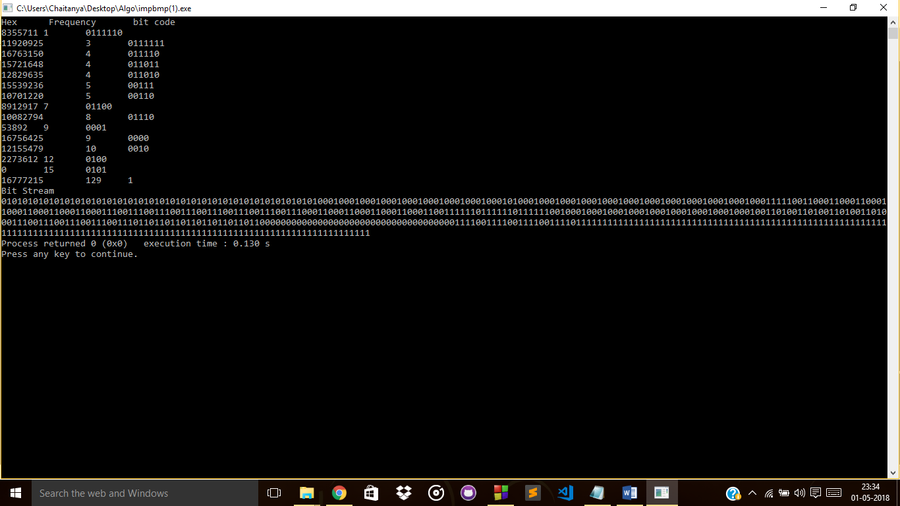
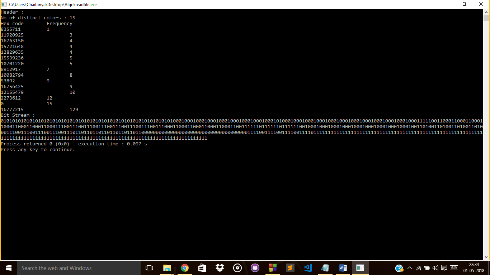

# Lossless Image Compression using Huffman Coding

## Introduction

Huffman coding is a lossless data compression algorithm. Using this algorithm we can assign variable-length bit codes to the data that is being compressed. The characters are assigned codes based on their frequency of occurrence and the characters with the highest frequency are assigned smallest length bit codes and the characters with the least frequency are assigned the longest length bit codes. 

Every 24-bit .bmp file starts with a 54-byte header, the 18th byte specifies the width of the image and the 22nd byte specifies the height of the image. After the header, the color of each pixel is specified by its RGB values. The color of the bottom right pixel is stored first. The colors are stored in the order of blue, green and red and each color takes 1 byte each. Therefore, each pixel requires 3 bytes.

The aim of image compression is to remove unwanted information from image so that it can be able to transmit or store data in an efficient form. 
Compression basically means removing unwanted information from image which only lead to the enhancement of memory space requirement without affecting quality of image.
The purpose of this project is to analyse Huffman coding technique which is basically used to remove the redundant bits in data by analysing different characteristics or specification like Peak Signal to Noise Ratio (PSNR), Mean Square Error (MSE) Bits Per Pixel (BPP) and Compression Ratio (CR) for the various input image of different size and the new method of splitting an input image into equal rows & columns and at final stage sum of all individual compressed images which not only provide better result but also the information content will be kept secure. 

## Algorithm
1. Read .bmp image and store its width, height, size and information of pixels in the Struct `imageInfo`.
1. The information of each pixel is saved in an object of the Class `Pixel` containing information about the RGB values of the pixel, and the corresponding hex values.
1. Number of distinct colors are calculated and the frequency of each distinct color and its hex value is stored in an object of Class `color`.
1. A Huffman tree is created using the information in step 3 and the bit codes are saved with their respective hex values and frequency in the Class `color`.
1. The header of the new file is written.
1. The entire Image Matrix is traversed and the corresponding bit code of the color of each pixel is written in the file.
1. The written file is saved with an extension of .cmpbmp.

## Proposed File Format (.cmpbmp)

The first 4 bytes of the file contain the number of distinct colors in the compressed image. The information of hex value and its corresponding frequency is also stored for each distinct color where both hex value and frequency takes 4 bytes each.

The actual image contains the bit codes generated by Huffman coding and is the actual compressed data.
Using the information in header a Huffman tree is created and bit codes are generated which are used to decompress the image.

## License

This repository is licensed under the terms of the Apache License 2.0 license.

## How to run the code

1. Git clone the repository to your local computer.
1. Open a terminal in the folder containing the repository.
1. Run `$ sudo g++ compress_bmpimage.cpp` to compile the CPP file.
1. Execute `$ ./a.out` to run the CPP file.

## Screenshots
Input Image

Output Image

